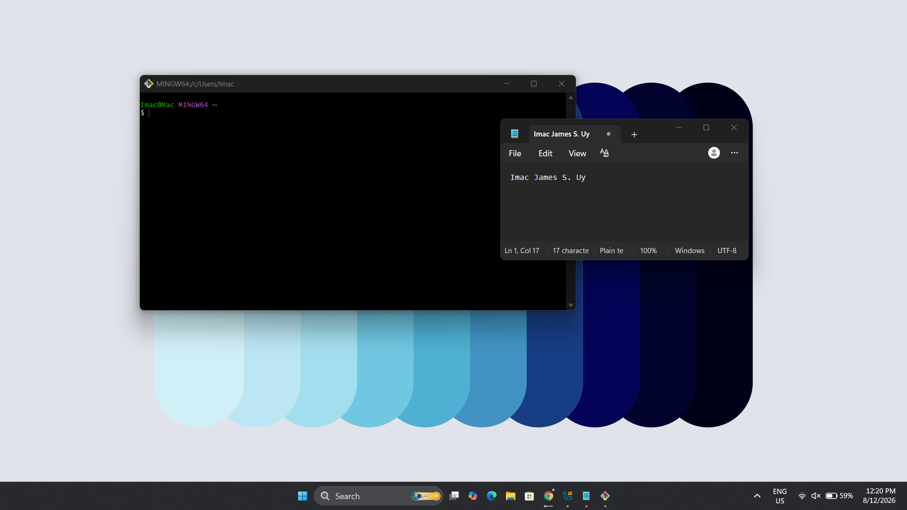
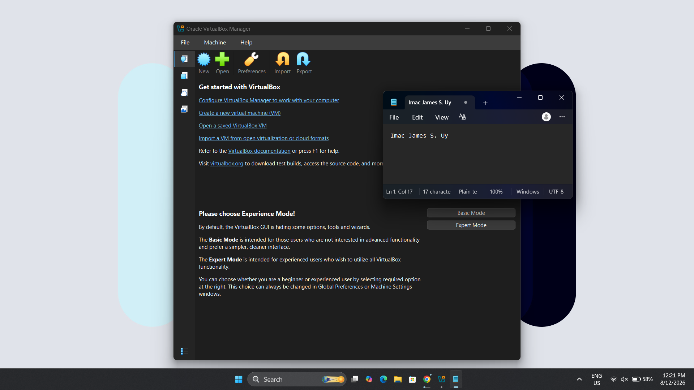
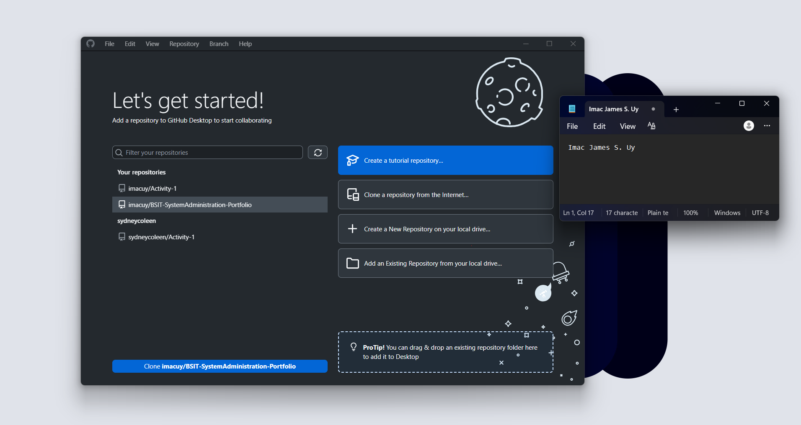
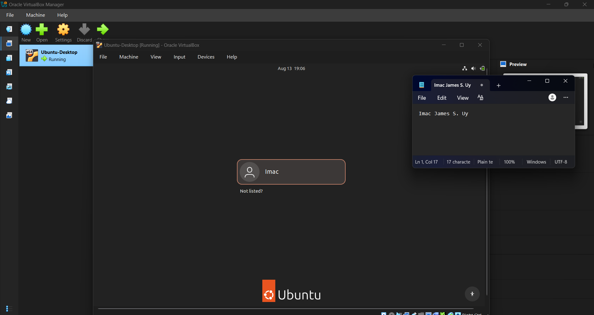

# Week 1 - Building My Professional Environment

## Student Information
* **Name:** Imac James S. Uy
* **Course:** Bachelor of Science in Information Technology (BSIT)
* **Section:** 3C WAM
* **Date:** August 8 2026

# Objectives
* Establish a fully configured professional workstation and virtualization environment.
* Set up professional profiles on GitHub and LinkedIn for industry networking and portfolio management.
* Learn foundational version control workflows utilizing Git and Markdown documentation.

# Software Installed
* Git (Version Control)
* GitHub Desktop (Git GUI)
* Visual Studio Code (Code Editor)
* VirtualBox (Virtual Machine Platform)
* Ubuntu Desktop/Server ISO (Linux Operating System)
* Windows 11 Enterprise Evaluation ISO (Windows Virtual Machine)

# Professional Accounts
* **GitHub:** https://github.com/imacuy
* **LinkedIn:** https://www.linkedin.com/in/imac-uy-450ab441b/

## Installation Screenshots

* **Git Installation:**

* **VirtualBox Installation:**

* **GitHub Desktop:**

* **VirtualBox Ubuntu:**

## Challenges Encountered
1. **Challenge 1:** Encountered permission errors and command-line path recognition issues when initializing local repositories and configuring Git for the first time.
   * **Solution:** Re-ran the Git installer with administrative privileges, verified that the system environment PATH variables were properly set, and configured the global username and email credentials via Git Bash.

2. **Challenge 2:** The Ubuntu and Windows 11 Enterprise Evaluation ISO files failed to boot or threw hardware acceleration errors when starting the virtual machines in VirtualBox.
   * **Solution:** Restarted the host machine, accessed the BIOS/UEFI settings to enable Intel VT-x / AMD-V hardware virtualization support, and allocated appropriate RAM and CPU core sizes to the virtual machine instances.

3. **Challenge 3:** Markdown preview layout issues where local installation screenshots inside the nested sub-directories failed to render correctly or showed broken image icons on GitHub.
   * **Solution:** Corrected the relative file paths and directory syntax within the `README.md` file to properly match the exact folder hierarchy (`screenshots/filename.png`).

# Reflection
## Reflection
Setting up a professional system administration workspace during Week 1 provided a foundational understanding of the toolsets and digital discipline required in modern IT environments. As a future System Administrator, mastering version control tools like Git and GitHub changes how technical tasks are managed, shifting away from unorganized local storage toward traceable, collaborative, and industry-standard version histories. Furthermore, configuring virtualization platforms like VirtualBox and handling operating system ISO environments prepares the essential groundwork for testing enterprise systems safely without risking host stability. 

Beyond technical software installations, establishing professional online profiles on platforms like GitHub and LinkedIn emphasizes the importance of digital branding and "learning in public." Maintaining organized documentation through Markdown ensures that troubleshooting steps, configurations, and project outputs are properly recorded for auditing and peer collaboration. 

Finally, the process of documenting every challenge—from BIOS virtualization settings to GitHub file pathing—taught me that being an effective System Administrator is as much about patience and problem-solving as it is about technical knowledge. This initial workstation setup successfully establishes the structured workflow and foundational competence required to tackle complex infrastructure configurations and upcoming laboratory activities throughout the rest of the semester. I am now more confident in my ability to manage a professional workspace and am eager to apply these skills to the more advanced projects ahead.

# References
* Git Documentation. https://git-scm.com/doc
* Oracle VirtualBox User Manual. https://www.virtualbox.org/manual/
* Ubuntu Official Documentation. https://help.ubuntu.com/
